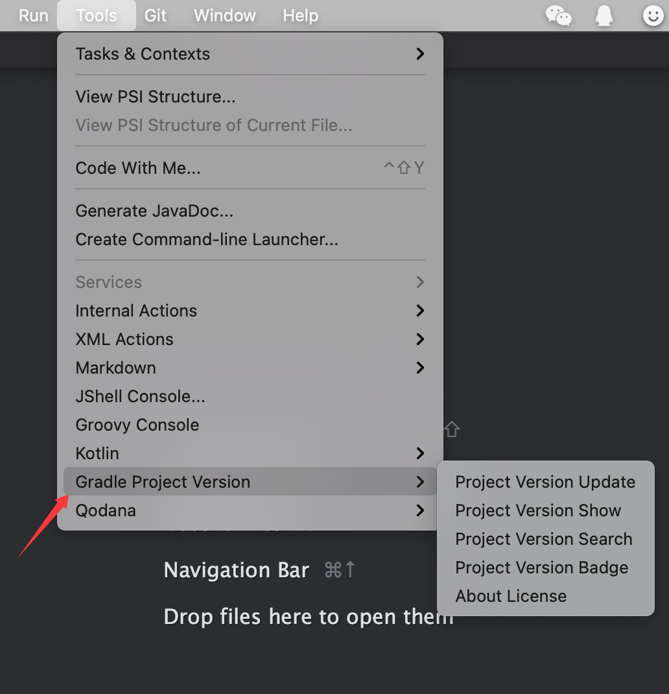
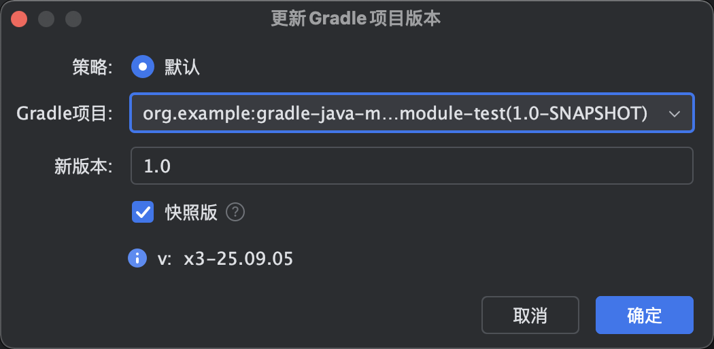
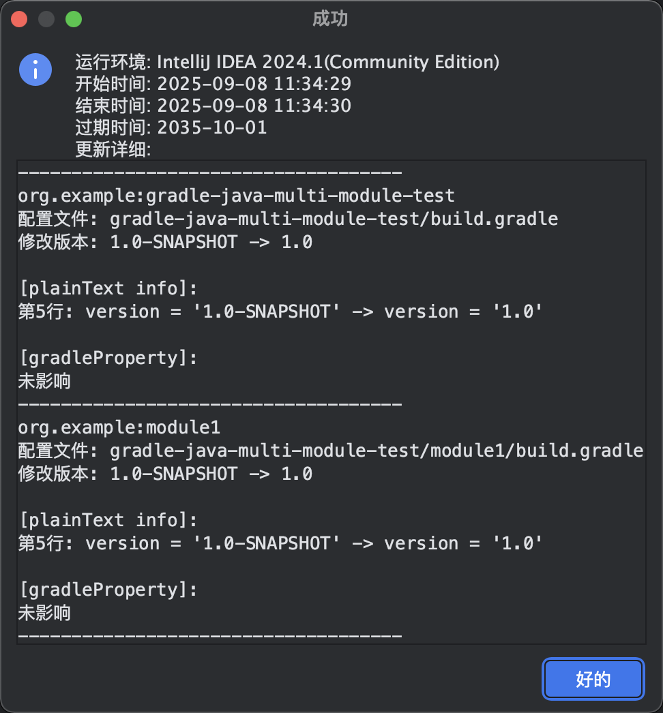
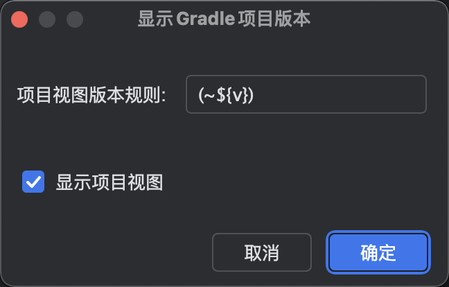
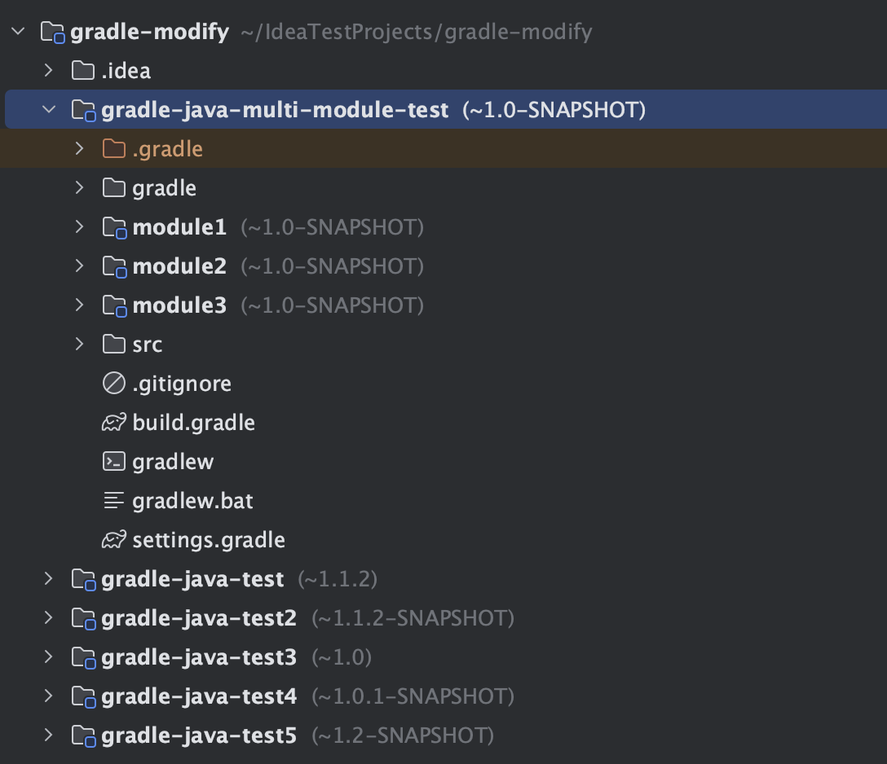
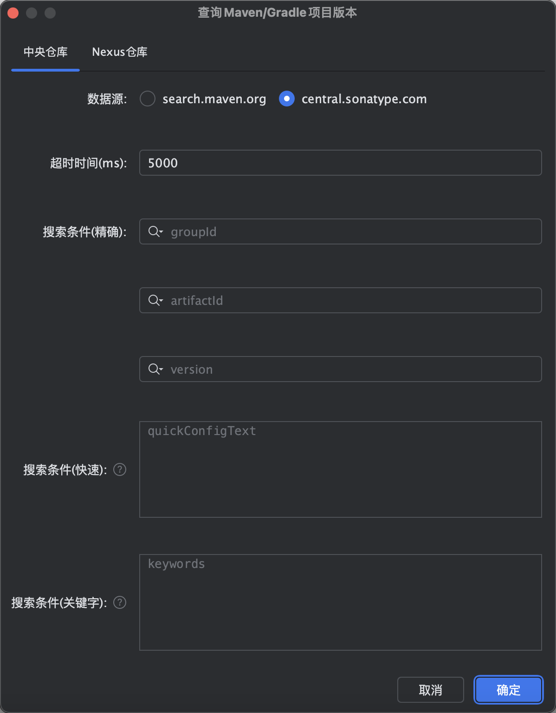
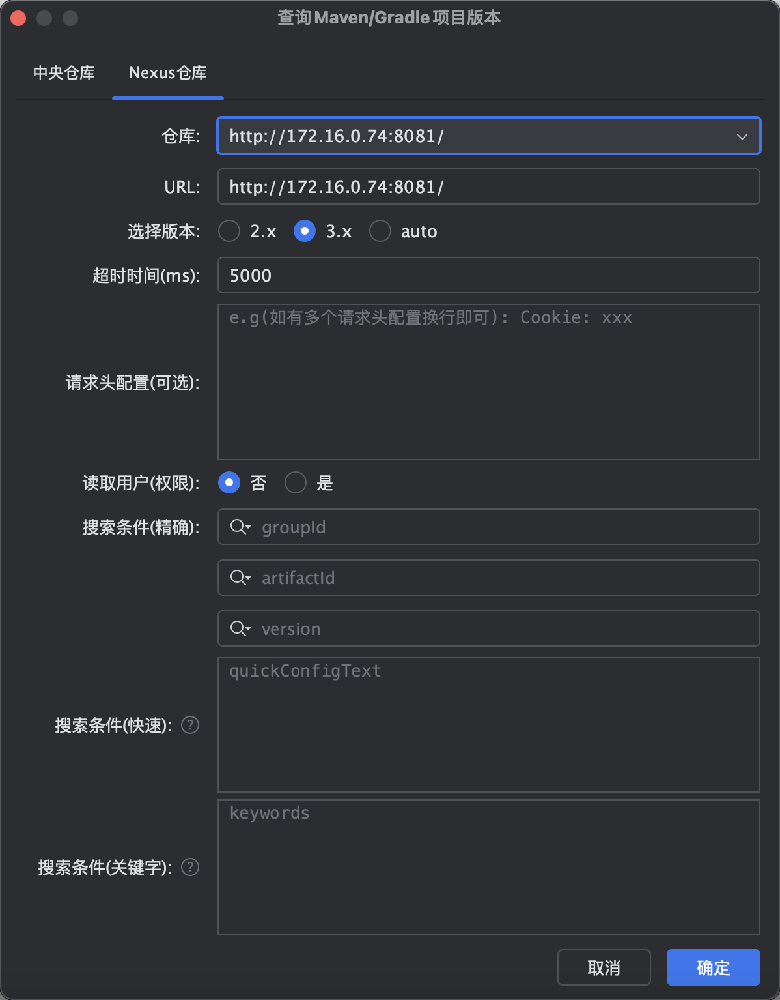
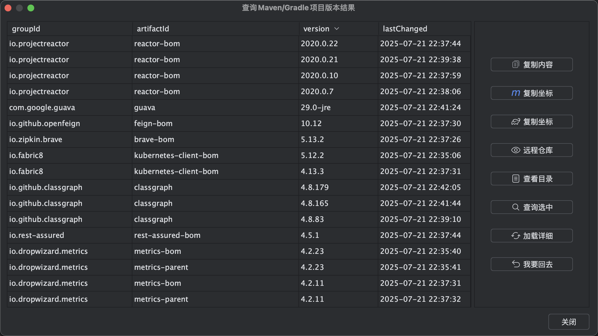
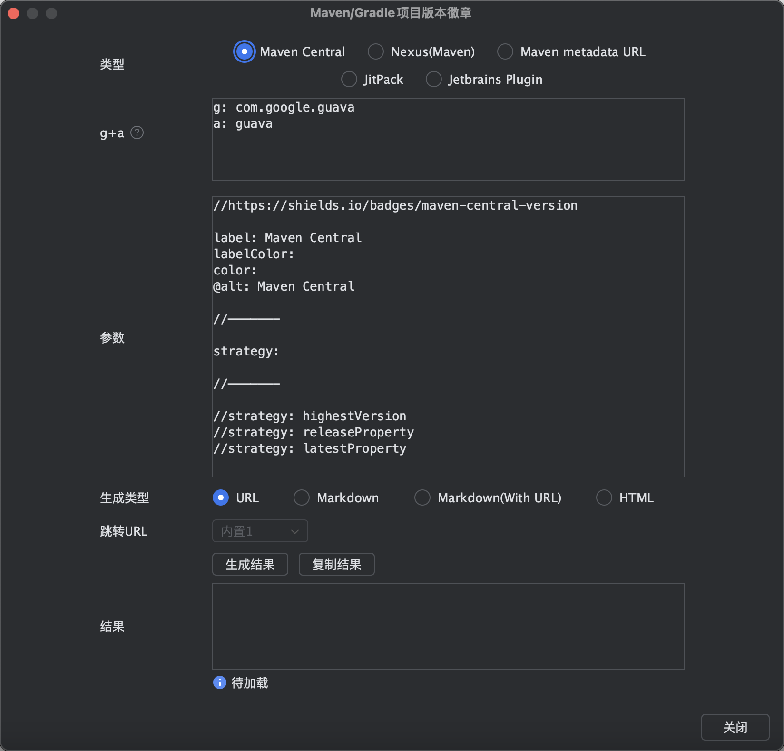
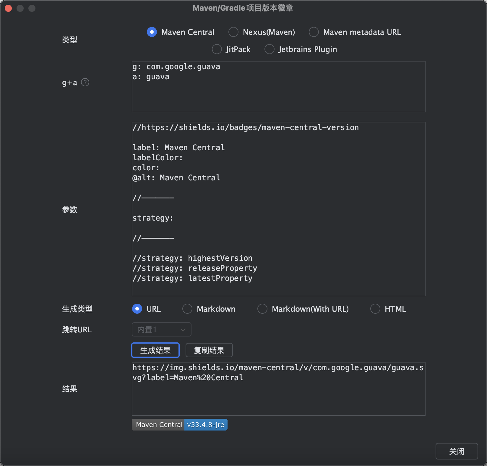

# Gradle With Me(GPVP) - Gradle Project Version Plugin

[](https://plugins.jetbrains.com/plugin/28419-gradle-with-me-gpvp-)
[](./README.md)
[](https://joker-pper.github.io/intellij-gpvp-gradle/)
[](docs/LICENSE_Page.md)

<div align="center" style="text-align: center;">
    
</div>

Gradle项目版本插件，可用于版本快速傻瓜式升级及项目版本展示和项目版本搜索并支持快速生成常见项目版本的徽章.
<br/>
<br/>
Gradle Project Version Plugin, Support Quick Update Version And Show Project Version And Search Project Version And Quick Generate Badges For Common Project Version.

<hr/>

<p style="font-size: 20px; font-weight: bold; color:red;">
欢迎大家加入QQ群，不仅能在第一时间获取最新插件资源，还能一起交流学习！
</p>

<p>QQ交流群: <a href="https://qm.qq.com/q/iU86CoU8EM">点击链接加入群聊【Gradle With Me插件交流群】</a></p>


<hr/>


## 前言

工欲善其事必先利其器！ 轻便快捷是初心，势必为节省您的大量时间和心力而前行！让更多的时间和价值留在更重要的地方！！！<br/>
<b>希望它能成为一款真正有价值的插件，避免大家花费更多的精力和心力在这些繁琐的流程中。当然这也需要您的支持，以便我们提供更好的服务和迭代，利他和利己不是可以共存的嘛~ 让我们一起走得更远！</b><br/>


## 更新计划

版本号: <span style="color: red">1.2.x</span>

预计发布时间: <span style="color: red">???</span>

详情: [戳这里直达](docs/Next.md)

## 优惠活动
<p style="font-size: 18px; font-weight: bold;color: red;">
 🔥限时激活优惠（最低可至每月不到¥4）
</p>

我们提供了以下激活授权规格，您有需要可在公众号菜单 <span textstyle="" style="color: rgb(255, 76, 0)">GPVP</span>&nbsp;&gt;&nbsp;<span textstyle="" style="color: rgb(255, 76, 0)">激活链接</span> 查看详情，也可随时进行留言咨询。
<div align="left" style="text-align: left;">
<br/>    
￥19.9 1个 / 3月（9.1-10.25）<br/><br/>
￥29.9 1个 / 6月（9.1-10.25）<br/><br/>
￥39.9 1个 / 一年（9.1-10.25）<br/><br/>
</div>

## 如何激活？

搜索微信公众号 <a style="color: rgb(255, 76, 65);" href="https://mp.weixin.qq.com/mp/profile_ext?action=home&__biz=MzkyODk0MTA1MA==&scene=124#wechat_redirect" target="_blank">“新程快咖员”</a>（<a href="https://mp.weixin.qq.com/mp/qrcode?scene=10000004&size=102&__biz=MzkyODk0MTA1MA==&mid=2247483700&idx=1&sn=2a00414552461b2235b1d4b5b6878f16&send_time=" target="_blank">点击查看二维码</a>）根据菜单链接进行操作（<span style="color: rgb(255, 76, 65);">在进行正常激活时可叠加插件发布的剩余试用天数！无需额外等待插件试用到期！</span>）

<span style="color: red">注：</span>如有问题，您可直接在公众号发送消息进行留言

除插件发布后直接试用外，也可免费申请试用！按照公众号指引步骤即可。


## 如何找到操作菜单？

Tools > Gradle Project Version



## 特性

### Gradle项目版本更新

无论是快照版还是release版，输入后提交一键轻松帮您搞定版本值升级或回退（再也不用头疼和花费大量时间调整版本值啦）。还会为您展示修改的具体细节~ 简化您的工作流程，为您节省大量宝贵时间！

<b>注：</b>

首先建议大家在修改版本时一定要使用版本管理工具（备份），无论是否使用这款插件进行版本更改，都可以在出现问题时进行快速恢复或回滚！！！

该功能依赖idea读取的Gradle数据，如您的配置发生了变更，需要先刷新完成后再使用该功能。

该功能只支持限定的标准格式，如有问题可进行反馈。

<span style="color: #cb1414;">
如果您是首次使用，建议您先使用<b>版本管理工具（备份）</b>验证插件是否完美契合自己的项目场景（参考第一条）。<br/><br/>
当该功能发生<b>重大调整时</b>（会先尝试发布插件为 “xxx-beat” 的版本）并在操作界面展示<b>功能更新标识（含更新日期）</b>。您此时在<b>升级版本后若发现功能更新标识变更，为了保证升级后的功能符合预期需要您再次重新验证</b>以免对您造成困扰。如果发现存在问题您可进行上报和先临时回退使用变更前的版本。<br/>
</span>
<br/>

<span style="color: rgb(255, 76, 65);">
如果遇到自己的项目不支持（可能是特殊场景），烦请上报示例（需脱敏），让我们一起进一步完善插件~
</span>
<br/>
<br/>





+ 其他

#### 快照版

选中：如果新版本输入框的文本值是快照版（以-SNAPSHOT结尾，不区分大小写）则直接作为新版本，反之则以新版本输入框的文本值拼接-SNAPSHOT作为新版本.

未选中: 新版本输入框的文本值直接作为新版本.


### Gradle项目版本显示

可直接在项目视图中展示版本值，一眼便能知晓当下版本~ 并提供自定义展示规则能力（其中${v}为固定版本值表达式）。



#### 项目视图展示




### Maven/Gradle项目版本搜索

支持查询中央仓库最新依赖版本，也可以快速查询Nexus仓库(远程/私服)依赖版本。 简化您的工作流程，为您节省大量宝贵时间！欢迎上手体验~

提供便捷式搜索能力(Maven pom配置或Gradle依赖配置粘贴后即可查询，也可通过关键字进行查询)

一键复制依赖坐标

<span style="color: rgb(255, 76, 65);">一键访问文件目录（兼容Nexus低版本）</span>

<span style="color: rgb(255, 76, 65);">一键加载更新时间（兼容Nexus低版本）</span>

快速查看版本详情页

Nexus仓库查询增加缓存（内存级）减少一定时间内的查询详细请求，默认用户级Nexus仓库缓存时效（snapshot为1分钟，release为30分钟），并提供可配置参数项调整（最小值为1分钟，最大值为360分钟）

...

(持续更新优化！欢迎提供优化建议~)

#### 中央仓库




#### Nexus仓库 (远程/私服)





### Maven/Gradle项目版本徽章

支持快速生成常见Maven/Gradle项目版本的徽章 (依赖shields.io能力)。

提供常见参数使用，可快速自定义文本及颜色

增加内部@alt参数用于定义HTML、Markdown、Markdown(With URL)中alt属性的文本

提供URL、Markdown、Markdown(With URL)、HTML生成类型

提供支持groupId+artifactId快速输入能力(如Maven pom配置或Gradle依赖配置粘贴即可)

Markdown(With URL)默认提供内置跳转链接，也可自定义输入跳转链接






### 国际化支持

支持英文、中文、简体中文（中国）及中文（台湾）

## 其他

### conf.properties配置文件

可用于进行个性化项的配置

+ 全局配置: 用户主目录/gpvp/conf.properties

+ 项目配置: 用户项目工作目录/.idea/gpvp/conf.properties (优先级最高)

支持配置如下：

```
# 自定义使用语言
#my.language=zh_CN
#my.language=zh_TW
#my.language=en


# 搜索nexus3查看远程仓库使用新url (配置值存在多个时用,分割)
#search.nx3.repository-version-use-new-url=http://localhost:8081/
#search.nx3.repository-version-use-new-url=http://localhost:8081/,http://localhost:8083/

# 搜索nexus缓存保存周期（单位：分钟，配置值应 > 0，未配置或不合法时使用默认值 360）
#search.nx.cache-save-period=360

# 用户私服release版查询结果缓存有效期，未配置时默认30分钟 （单位：分钟，配置值应 > 0 且 <= 360。当未配置或 < 1 时使用默认值，当值 > 最大值时则使用默认最大值）
search.user-repository-search-result.release-cache-period=30

# 用户私服快照版查询结果缓存有效期，未配置时默认1分钟 （单位：分钟，配置值应 > 0 且 <= 360。当未配置或 < 1 时使用默认值，当值 > 最大值时则使用默认最大值）
search.user-repository-search-result.snapshots-cache-period=1


# 复制gradle坐标是否使用Kotlin格式，未配置时默认false
#gradle-coordinate-copy-with-kotlin=false

# 是否启用gradle自动加载nexus仓库url，未配置时默认true
#enable-gradle-auto-load-nexus-repository-urls=true

# 是否启用更新版本的行尾注释处理，未配置时默认true
#enable-update-version-end-of-line-comment-mark-deal=true

```

### 系统内置语言

+ zh         中文
+ zh_CN      简体中文（中国）
+ zh_TW      中文（台湾）
+ en         英文

#### 如何指定当前使用的语言？

可通过系统默认语言，也可在conf.properties中进行指定要使用的语言


## 联系我们

如果您有任何问题或建议，可以通过以下方式：

提交 [Github Issues](https://github.com/joker-pper/intellij-gpvp-gradle/issues)
<br/>
<br/>
QQ交流群: <a href="https://qm.qq.com/q/iU86CoU8EM">点击链接加入群聊【Gradle With Me插件交流群】</a>
<br/>
<br/>
微信交流群: 在微信公众号 <a style="color: rgb(255, 76, 65);" href="https://mp.weixin.qq.com/mp/profile_ext?action=home&__biz=MzkyODk0MTA1MA==&scene=124#wechat_redirect" target="_blank">“新程快咖员”</a>（<a href="https://mp.weixin.qq.com/mp/qrcode?scene=10000004&size=102&__biz=MzkyODk0MTA1MA==&mid=2247483700&idx=1&sn=2a00414552461b2235b1d4b5b6878f16&send_time=" target="_blank">点击查看二维码</a>）直接留言<span textstyle="" style="color: rgb(255, 76, 0)">“微信群”</span>即可获取
<br/>
<br/>
公众号: <a style="color: rgb(255, 76, 65);" href="https://mp.weixin.qq.com/mp/profile_ext?action=home&__biz=MzkyODk0MTA1MA==&scene=124#wechat_redirect" target="_blank">“新程快咖员”</a>（<a href="https://mp.weixin.qq.com/mp/qrcode?scene=10000004&size=102&__biz=MzkyODk0MTA1MA==&mid=2247483700&idx=1&sn=2a00414552461b2235b1d4b5b6878f16&send_time=" target="_blank">点击查看二维码</a>）
<br/>
<br/>
Email: [yyc_xincheng@163.com](mailto:yyc_xincheng@163.com)
<br/>
<br/>
