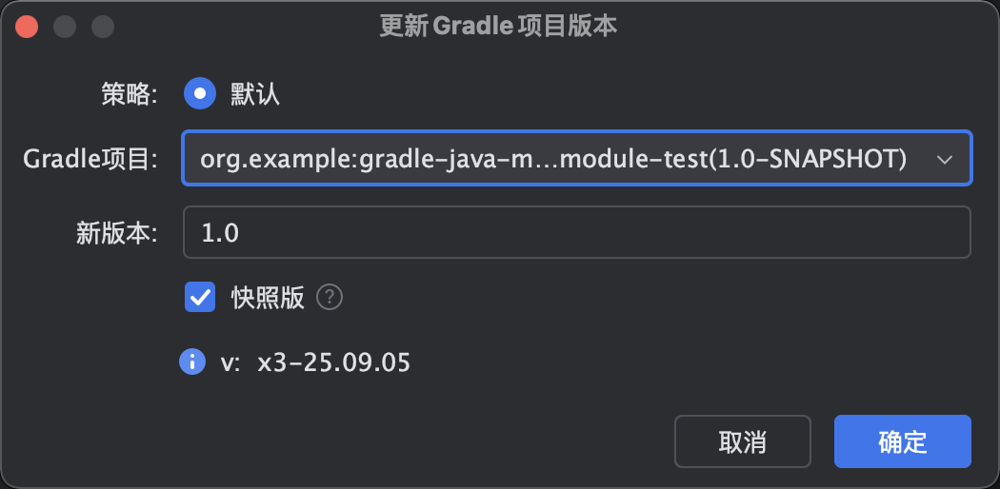
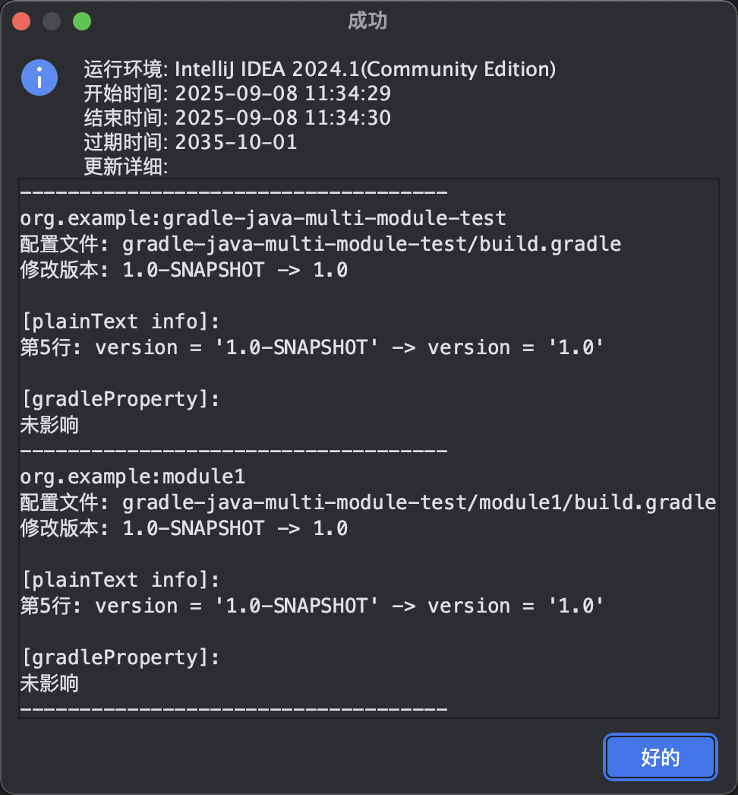
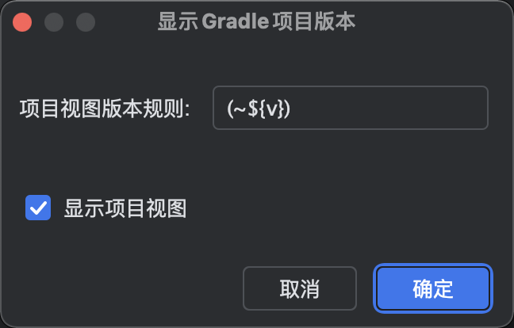
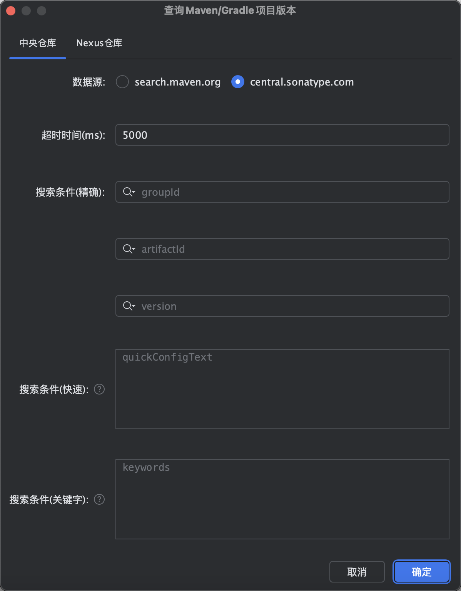
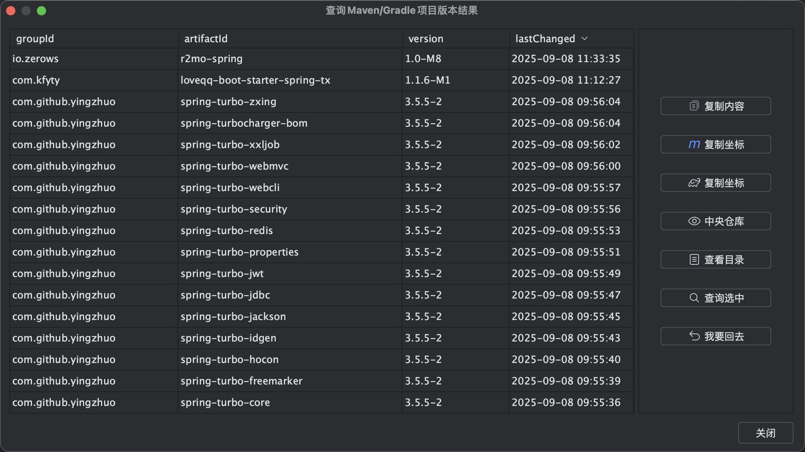
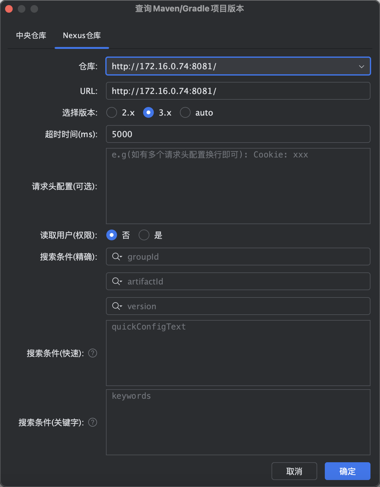
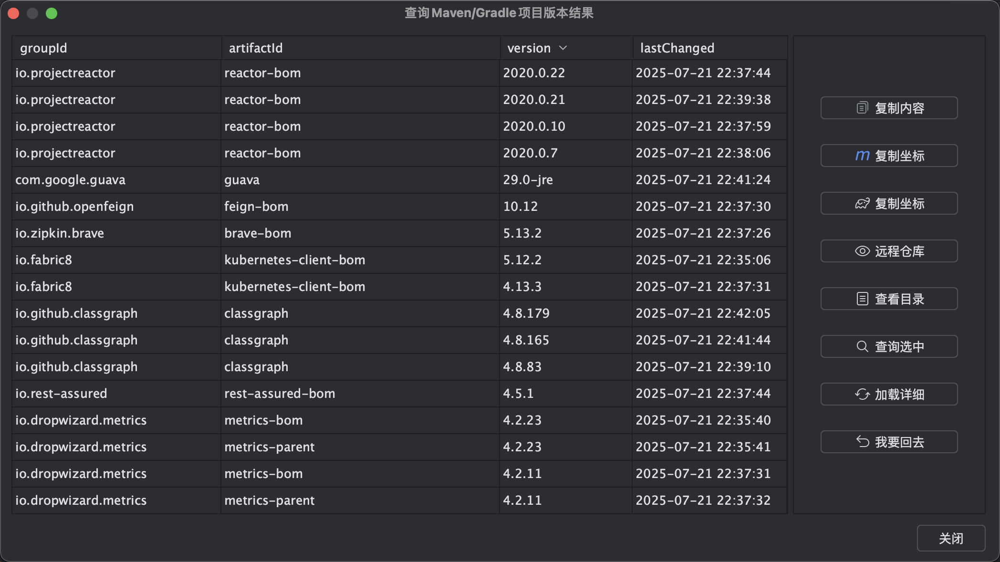
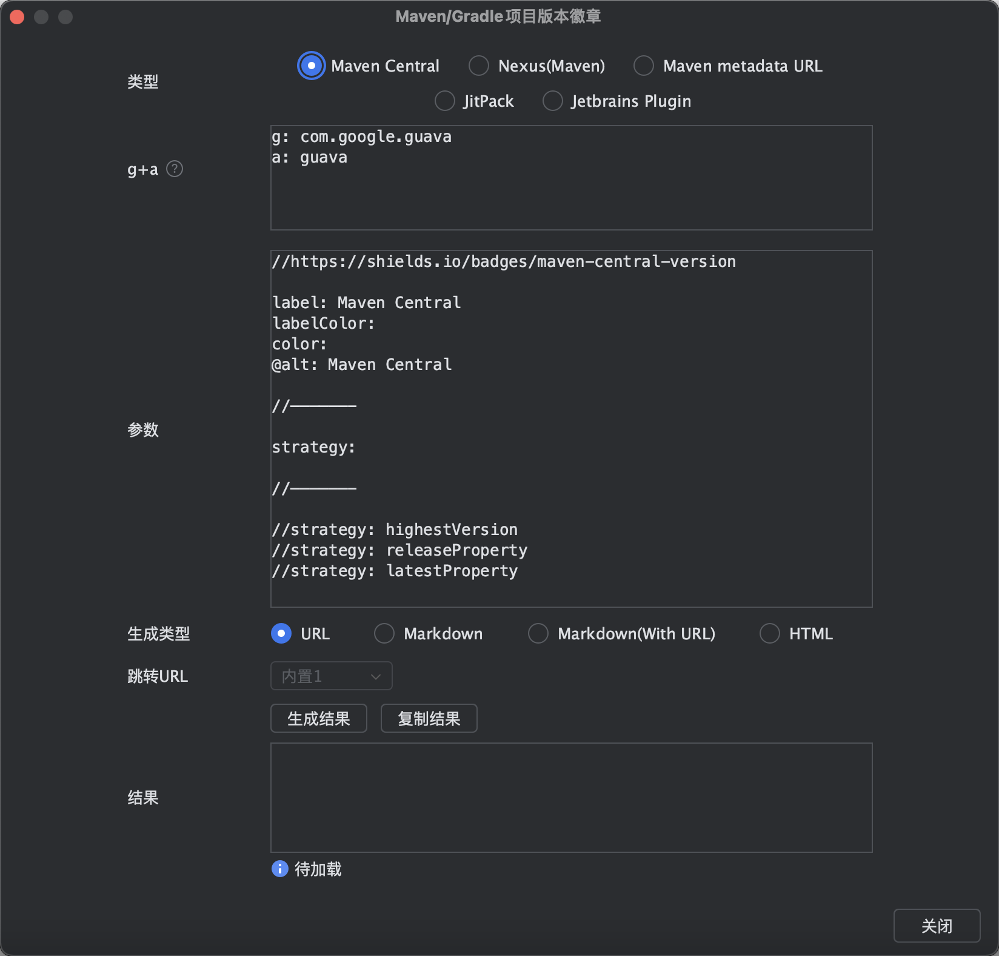
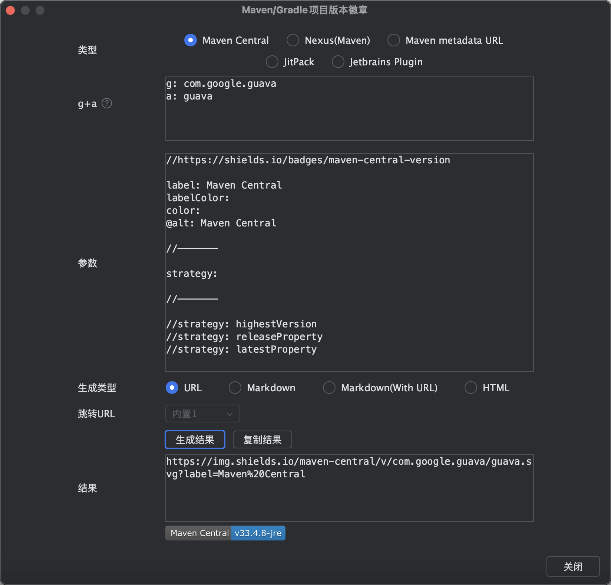

[返回主页](../README.md) / [返回Pro主页](../pro/README.md)

## 特性详情

### Gradle项目版本更新

无论是快照版还是release版，输入后提交一键轻松帮您搞定版本值升级或回退（再也不用头疼和花费大量时间调整版本值啦）。还会为您展示修改的具体细节~ 简化您的工作流程，为您节省大量宝贵时间！

<b>注：</b>

首先建议大家在修改版本时一定要使用版本管理工具（备份），无论是否使用这款插件进行版本更改，都可以在出现问题时进行快速恢复或回滚！！！

该功能依赖idea读取的Gradle数据，如您的配置发生了变更，需要先刷新完成后再使用该功能。

该功能只支持限定的标准格式，如有问题可进行反馈。

如果您是首次使用，建议您先使用<b>版本管理工具（备份）</b>验证插件是否完美契合自己的项目场景（参考第一条）。  
当该功能发生<b>重大调整时</b>（会先尝试发布插件为 “xxx-beat” 的版本）并在操作界面展示<b>功能更新标识（含更新日期）</b>。您此时在<b>升级版本后若发现功能更新标识变更，为了保证升级后的功能符合预期需要您再次重新验证</b>以免对您造成困扰。如果发现存在问题您可进行上报和先临时回退使用变更前的版本。 

 

如果遇到自己的项目不支持（可能是特殊场景），烦请上报示例（需脱敏），让我们一起进一步完善插件~

 
 

+ 其他

#### 快照版

选中：如果新版本输入框的文本值是快照版（以-SNAPSHOT结尾，不区分大小写）则直接作为新版本，反之则以新版本输入框的文本值拼接-SNAPSHOT作为新版本.

未选中: 新版本输入框的文本值直接作为新版本.

### Gradle项目版本显示

可直接在项目视图中展示版本值，一眼便能知晓当下版本~ 并提供自定义展示规则能力（其中${v}为固定版本值表达式）。

#### 项目视图展示

### Maven/Gradle项目版本搜索

支持查询中央仓库最新依赖版本，也可以快速查询Nexus仓库(远程/私服)依赖版本。 简化您的工作流程，为您节省大量宝贵时间！欢迎上手体验~

提供便捷式搜索能力(Maven pom配置或Gradle依赖配置粘贴后即可查询，也可通过关键字进行查询)

一键复制依赖坐标

一键访问文件目录（兼容Nexus低版本）

一键加载更新时间（兼容Nexus低版本）

快速查看版本详情页

Nexus仓库查询增加缓存（内存级）减少一定时间内的查询详细请求，默认用户级Nexus仓库缓存时效（snapshot为1分钟，release为30分钟），并提供可配置参数项调整（最小值为1分钟，最大值为360分钟）

...

(持续更新优化！欢迎提供优化建议~)

#### 中央仓库

#### Nexus仓库 (远程/私服)

### Maven/Gradle项目版本徽章

支持快速生成常见Maven/Gradle项目版本的徽章 (依赖shields.io能力)。

提供常见参数使用，可快速自定义文本及颜色

增加内部@alt参数用于定义HTML、Markdown、Markdown(With URL)中alt属性的文本

提供URL、Markdown、Markdown(With URL)、HTML生成类型

提供支持groupId+artifactId快速输入能力(如Maven pom配置或Gradle依赖配置粘贴即可)

Markdown(With URL)默认提供内置跳转链接，也可自定义输入跳转链接

### 项目配置同步功能

支持自动同步JDK、语言level规范等配置，进一步统一团队SDK规范，一人配置，全员共享！(需要提交配置到远程仓库)

无论是在项目打开，还是Git clone、Git分支切换、Git还原等场景下，自动识别切换到对应的JDK版本及Gradle Build等配置，节省团队和个人在Git clone及Git分支存在不同JDK版本等场景需多次手动配置IDE环境等繁琐步骤及时间!

其他说明：JDK Home Path中的 ~ 代表为用户主目录，用于动态识别出不同用户名下的统一路径。

### 国际化支持

支持英文、中文、简体中文（中国）及中文（台湾）
